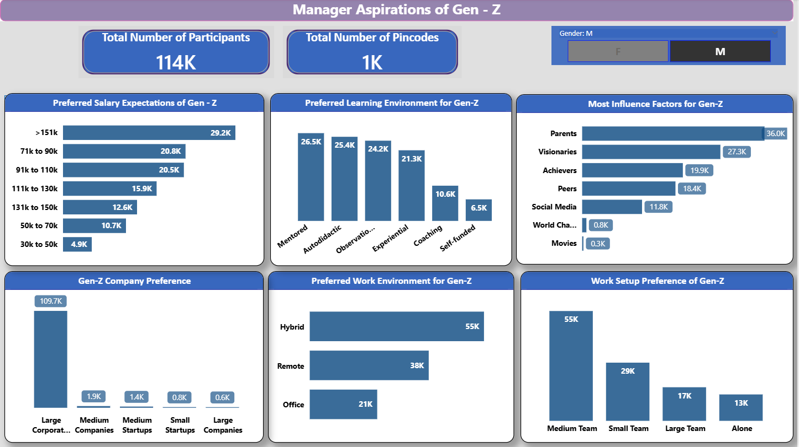
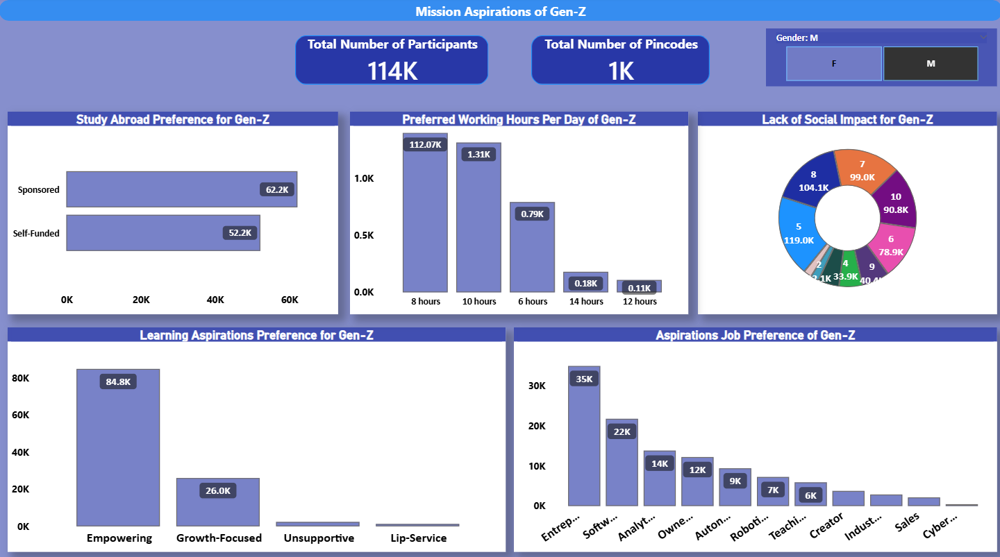

# Understanding Gen-Z Career Aspirations

> A data-driven analysis of Gen-Z career aspirations using SQL, Excel, and Power BI.

---

## 📌 Project Overview
This project analyzes Gen-Z career aspirations using survey data. The objective is to understand career preferences, work environment choices, salary expectations, and the role of social impact in career decision-making. The analysis helps identify trends that organizations can use to better align with Gen-Z expectations.

---

## 📊 Key Objectives
- Analyze Gen-Z career preferences across industries  
- Understand work environment choices (Remote, Hybrid, On-site)  
- Study salary expectations and financial goals  
- Evaluate the influence of social impact and personal values  
- Compare insights by gender and location  

---

## 🛠 Tools & Technologies
- SQL  Queries (MySQL)
- Microsoft Excel
- Power BI
- CSV Dataset Cleaning & Standardizing
- ETL & EDA
- Statistics 

---

---

## 🔍 Project Insights

### 1️⃣ Career Aspirations Overview
- Gen-Z respondents prioritize **career growth, skill development, and financial stability**.
- Career choices are influenced by a balance of **personal interests and practical considerations**.
- Respondents prefer roles that offer **long-term growth opportunities**.

---

### 2️⃣ Work Environment Preferences
- **Hybrid work** emerges as the most preferred work environment.
- Remote work is valued for **flexibility and work–life balance**.
- On-site work is least preferred and mainly chosen for **collaboration and structured environments**.

---

### 3️⃣ Salary Expectations & Financial Goals
- Salary plays a **critical role** in career decision-making.
- Gen-Z expects **competitive compensation** aligned with skills and responsibilities.
- Financial security strongly influences **first-job acceptance**.

---

### 4️⃣ Social Impact & Personal Values
- Social impact has a **moderate influence** on career choices.
- A segment of Gen-Z prefers **mission-driven and socially responsible organizations**.
- However, salary and career growth often outweigh social impact considerations.

---

### 5️⃣ Gender-Based Insights
- Female respondents show higher preference for **flexible and hybrid work models**.
- Male respondents slightly prioritize **salary and financial growth**.
- Both genders equally value **learning opportunities and career advancement**.

---

### 6️⃣ Influence of Parents & Social Media
- Parents remain a **significant influence** on Gen-Z career decisions.
- Social media and influencers play a **secondary but noticeable role**.
- Digital platforms help Gen-Z explore career paths and industry trends.

---

### 7️⃣ Industry & Career Preference Trends
- High interest observed in **technology, IT services, and corporate sectors**.
- Creative and socially impactful careers attract a **growing segment** of respondents.
- Gen-Z prefers careers offering **stability, flexibility, and continuous learning**.

---

### 8️⃣ Key Takeaways
- Hybrid work is the most desirable work model.
- Salary and financial stability are top priorities.
- Social impact is important but not the primary decision driver.
- Flexibility and growth opportunities define Gen-Z career expectations.

---

### 9️⃣ Business Recommendations
- Adopt **hybrid and flexible work policies**.
- Offer transparent **salary structures and growth paths**.
- Promote organizational values and social initiatives.
- Invest in **training, upskilling, and early-career development programs**.

---

## 📸 Project Dashboard_Insights

### Dashboard Using Microsoft Excel

### Dashboard Using Microsof Power BI

---

## 📌 Conclusion
This project provides data-driven insights into Gen-Z career aspirations. Organizations that balance compensation, flexibility, growth opportunities, and purpose will be better positioned to attract and retain Gen-Z talent in the modern workforce.

---

## 👤 Author
**Bhaskar Mandal,Data Analyst,IIT KGP**

